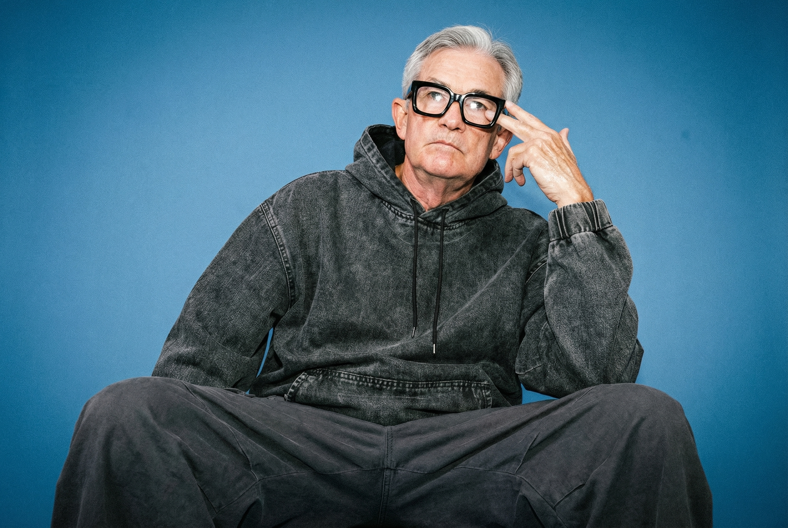
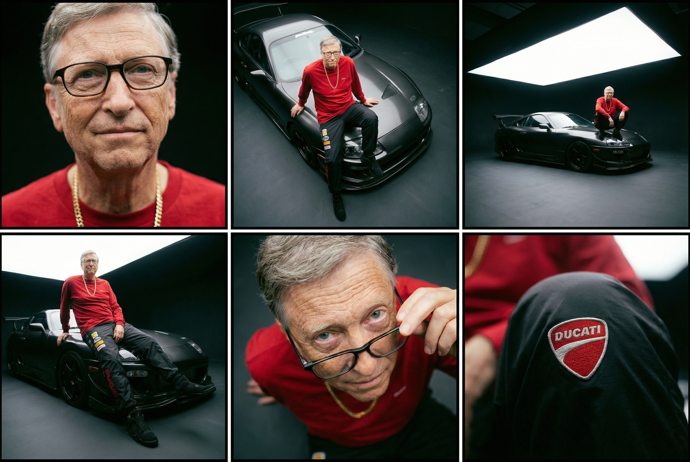
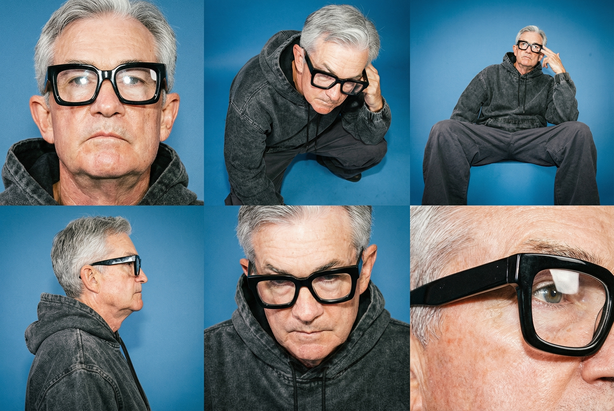
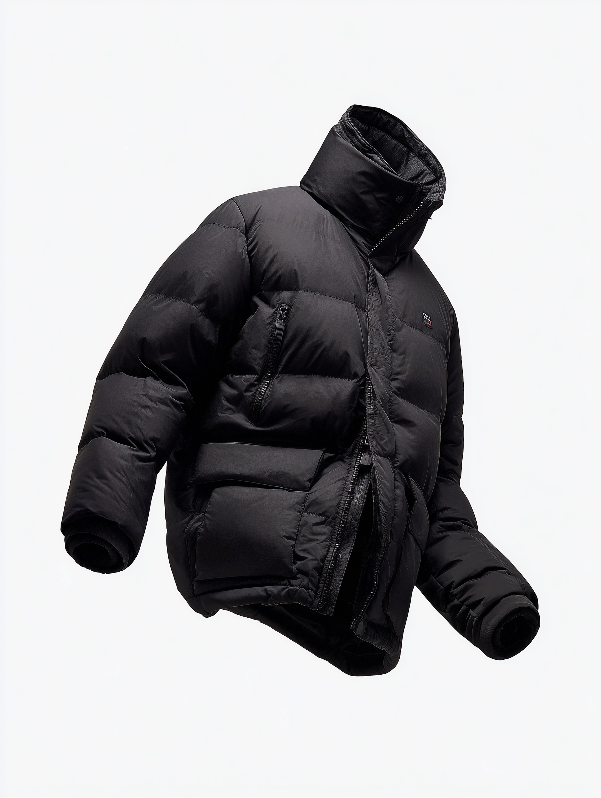
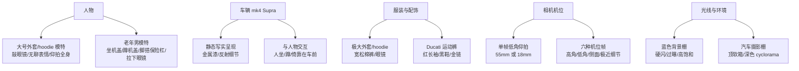

## Examples 提示词分析报告：按物品分类的动作与姿势整理

本报告基于 `/examples` 目录下三个工作流文件：

- `contact-sheet-tim.json`
- `contact-sheet-jpow.json`
- `contact-sheet-bills-supra.json`

主要按「被修改的物品」来整理提示词中描述的内容，包括人物、车辆、服装配饰、相机机位和光线环境，并重点提炼动作、姿势和表情相关信息。

---

## 1. 人物类（Human / 模特）

### 1.1 Oversized Jacket / Hoodie 系列（Tim / Jpow / Bills）

关联提示：

- `contact-sheet-tim.json` 中的高奢时尚照片与 contact sheet 提示
- `contact-sheet-jpow.json` 中的类似提示（其中一处将 jacket 写成 hoodie）
- `contact-sheet-bills-supra.json` 中共享的基准人物设定

**示例图像（单帧高奢模特对比）**

| Tim 单帧 | Jpow 单帧 | Bills 单帧 |
|---------|-----------|------------|
|  |  |  |

**人物设定**

- 职业/类型：高奢时尚模特（性别未限定）
- 造型核心：
  - 夸张大号外套或连帽卫衣（oversized jacket / hoodie）
  - 深灰色、宽松棉质长裤（dark grey baggy cotton pants）
  - 眼镜（glasses）

**表情与视线**

- 略显无聊的表情（slightly bored expression）
- 眉毛上扬（eyebrows raised）
- 视线看向镜头外侧（looking past the camera），不是直视镜头

**动作与姿势**

- 一只手抬起（one hand raised）
- 两根手指轻敲眼镜的侧边（two fingers tapping the side of the glasses）
- 画面为全身照（a full body shot of the subject）
- 相机机位从低处向上（image is from a low angle looking up at the subject），视觉上拉长人物比例、增强存在感

**皮肤与质感**

- 皮肤表现：
  - 画面整体过曝（over exposed）
  - 显著胶片颗粒（significant film grain）
  - 高饱和度（oversaturated）
  - 皮肤发亮、近乎油光（skin appears shiny, almost oily）
  - 眼镜框上有强烈白色高光反射（harsh white reflections on the glasses frames）

### 1.2 Older Man + Supra 系列（Bills Supra）

关联提示：

- `contact-sheet-bills-supra.json` 中的单帧基准图提示（老年男性 + Supra）
- 同文件中 contact sheet 的 6 帧 shot list 提示

**示例图像**

- 基准单帧：  
  

- 2×3 Contact Sheet：  
  

**人物与服饰设定**

- 身份：年长男性（older man）
- 服装细节：
  - 杜卡迪运动长裤（Ducati tracksuit pants）
  - 红色长袖上衣（red long sleeve top）
  - 黑色运动鞋（black sneakers）
  - 金色项链，戴在红色上衣外侧（gold chain around his neck over top of the red shirt）

**基准帧中的姿势/动作**

- 坐姿与腿部：
  - 随意坐在车的前机盖和前翼子板上（sitting casually on the front hood and fender of the car）
  - 一条腿自然垂向地面（one leg is dangling down towards the studio floor）
  - 另一条腿蜷起，脚自然放在前保险杠上（the other leg is pulled up with his foot resting naturally on the car's front bumper）
- 上半身：
  - 身体略向后倾（leaning back slightly）
  - 双手放在身后支撑身体（supporting himself on his hands behind him）
- 表情与视线：
  - 空白、模特式的表情（blank, model-like expression）
  - 看向镜头外（looking past the camera）

**Contact Sheet 中 6 帧关键人物动作**

在 contact sheet 提示中，每一帧都是在「同一服装、同一场景」下的不同定格姿态和机位。

1. **高奢美妆特写（High-Fashion Beauty Portrait）**  
   - 相机非常接近脸部，略高或略低于视线高度  
   - 强调骨骼结构与颈部附近的服装/金链细节  
   - 人物主要通过微表情和微姿态呈现“雕塑感”的时尚构图

2. **高角度三分之四视角（High-Angle Three-Quarter Frame）**  
   - 相机位于人物上方、偏离中心位置，对角线方向俯拍  
   - 人物继续坐在机盖上，通过俯视强调形体抽象和服装布局

3. **低角度斜向全身（Low-Angle Oblique Full-Body Frame）**  
   - 相机在地面附近，从斜向角度看向人物  
   - 拉长人物轮廓，强调鞋和车头保险杠  
   - 人物姿态延续坐姿，但透视更夸张

4. **宽环境工作室帧（Wide Environmental Studio Frame）**  
   - 相机拉远侧拍，完整呈现车辆侧面与人物  
   - 明确提出人物蹲在车机盖上（The model is squatting on the hood of the car）  
   - 人物由坐姿变为蹲姿，强调人与车及大型顶光软箱的整体关系

5. **高角度亲密肖像（Intimate Close Portrait From High Angle）**  
   - 相机高悬其上，向下拍摄  
   - 人物略微后仰头部，看向上方镜头（tilted their head back slightly to face upward）  
   - 核心动作：用一根手指向下拉眼镜，从镜框上方看出去  
   - 即使面对镜头，表情仍然空白、疏离（expression remains totally blank and distant，staring past the lens）

6. **极近距离服装/配饰细节（Extreme Detail Frame From a Non-Intuitive Angle）**  
   - 相机极近地贴近某个服装细节、配饰或材质  
   - 拍摄角度非直观，可能来自下方、背后或领口侧面  
   - 人物在画面中被“抽象化”为局部纹理，重点是材质与形状

**年龄与皮肤细节**

- 特别强调：
  - 高度写实皮肤质感（hyper-realistic detail）
  - 清晰可见的毛孔、细皱纹和年龄纹理（deep pores, fine wrinkles, authentic age-related texture）
- contact sheet 要求在所有帧中保持这些细节的一致性

### 1.3 Jpow 工作流中的人物

`contact-sheet-jpow.json` 的人物与 Tim 工作流基本一致：

- 使用同一套「大号外套/hoodie + 眼镜 + 深灰宽松裤」的设定
- 动作、表情和视线：  
  - 看向镜头外、略显无聊、眉毛上扬  
  - 一手抬起，两指敲眼镜  
  - 全身照、低机位仰拍
- 也包含一份通用 contact sheet 提示，强调服装与机位变化，但不涉及车辆/年龄等特定角色设定

**示例 Contact Sheet**

---

## 2. 车辆类（Vehicle / 车）

车辆主要出现在 `contact-sheet-bills-supra.json` 中。

**车辆设定**

- 车型：黑色 mk4 Supra（black mk4 Supra）
- 要求与参考图完全匹配（should match the reference image）
- 渲染要求：
  - 极度写实（hyper-realistic detail）
  - 精确的金属漆材质、机械部件细节与高光反射

**车辆与人物的空间关系**

- 基准帧：
  - 人物坐在机盖和前翼子板上，一条腿垂地，另一条腿脚搭在前保险杠上
  - 车作为画面中的大型主体，与人物共同构成时尚/汽车主题的组合
- contact sheet 中不同帧下，车辆的“被突出程度”不同：
  - 近距离人像帧：车辆多为背景或局部元素
  - 高角度俯视帧：强调从上方观察车与人的整体关系
  - 低角度全身帧：突出车头和轮胎/保险杠区域，与鞋形成对比
  - 宽环境帧：车的完整轮廓和工作室环境成为主视觉主体之一
  - 极近细节帧：可能仅剩车漆反射、logo 或局部部件，车辆抽象为纹理

整体上，车辆本身不“移动”，但通过人物的坐、蹲、倚靠以及不同机位，形成一套稳定但丰富的「人–车构图姿态」。

**示例：车辆与人物在同一 Contact Sheet 中的关系**

---

## 3. 服装与配饰（Clothing & Accessories）

服装与配饰是所有提示词中稳定性最高、约束最强的一类物品，尤其在 contact sheet 提示里多次强调「所有帧服装必须 100% 一致」。

### 3.1 主服装列表

1. **Oversized Jacket / Hoodie 系列**
   - 极度、近乎滑稽地巨大的外套或卫衣（extremely, almost comically oversized）
   - 深灰色宽松棉裤
   - 眼镜作为关键道具（被敲击、被拉下）

   **原始服装参考素材示例**

   

2. **Ducati 套装（Bills Supra）**
   - Ducati tracksuit pants
   - 红色长袖上衣
   - 黑色运动鞋
   - 金色项链（在特写和高角度肖像中是主视觉元素之一）

### 3.2 服装相关动作

- 与眼镜相关的手部动作：
  - 两指敲击眼镜侧边
  - 一指向下拉眼镜，从镜框上方看出去
- 服装本身不过度飘动或变形，变化主要来自：
  - 人物的坐姿/蹲姿/仰头/伸腿等
  - 相机机位和视角的变化

### 3.3 一致性要求

- contact sheet 提示里明确约束：
  - 不允许添加或删除任何服装、配饰、妆容或道具（Do not add or remove anything）
  - 所有帧中，服装、材质、颜色、纹理、缝线、配件、鞋子、首饰等必须完全一致

---

## 4. 相机与镜头（Camera / Lens / 机位）

提示词对相机的「位置、角度、焦段」有非常精细的约束，可以视为对「相机这个物品的动作与姿态」的描述。

### 4.1 单帧高奢照中的相机设定

1. Oversized Jacket / Hoodie 系列：
   - 机位：低角仰拍（low angle looking up at the subject）
   - 焦段：55mm 定焦镜头（55mm prime lens）
   - 介质：Fuji Velvia 胶片（shot on fuji velvia film）
   - 光源：硬闪光（hard flash）

2. Older Man + Supra 系列：
   - 机位：低角仰拍，且带 Dutch angle（倾斜构图）
   - 焦段：18mm 定焦广角（18mm prime lens）
   - 同样是 Velvia + 硬闪的风格

### 4.2 Contact Sheet 中 6 帧机位模式

在所有 contact sheet 提示中，6 帧主要通过「机位位置 + 距离 + 角度」来区分：

1. 贴近脸部，略高/略低于视线的近距离人像
2. 高角度、偏中心的 3/4 俯视，强调形状抽象和服装布局
3. 低角度斜向全身，拉长人物轮廓，强调鞋/车头
4. 侧面远距离视角（长焦压缩或宽环境框架），突出整体环境和车辆
5. 高位、近距离肖像，从上方向下看人物（有时人物头部略后仰）
6. 极近距离的细节特写，从非直观方向观察服装/配饰/纹理

这些机位组合形成一套完整的「场景内相机游走路径」，但每一帧都只描述最终定格位置，不描述运动过程。

---

## 5. 光线与环境（Lighting / Environment）

虽然光线与环境不是传统意义上的“物品”，但它们在提示词中是稳定且强约束的背景条件。

### 5.1 环境设定

- Oversized 系列：
  - 蓝色背景的摄影棚（studio environment with a blue background）
- Bills Supra 系列：
  - 高预算汽车摄影棚（pristine, high-budget automotive photography studio）
  - 深色无缝背景 cyclorama（seamless, dark studio cyclorama）

### 5.2 光线与风格

- Fuji Velvia 胶片色彩风格：
  - 高饱和（oversaturated）
  - 明显胶片颗粒（significant film grain）
  - 整体略过曝（over exposed）
- 光线分布：
  - 光集中于主体，向画面边缘逐渐衰减（light is concentrated on the subject and fades toward the edges of the frame）
  - 硬闪造成强烈高光与硬阴影
- Bills Supra 特有：
  - 顶部大型 softbox 作为主光（massive softbox downlight），在车身上产生长条高光

所有 contact sheet 提示都要求在 6 帧中保持上述光线与色彩风格的一致性。

---

## 6. 物品 → 动作/姿势 总览图

下面用一张简单的关系图，总结主要物品及其对应的动作/姿态角色。

---

## 7. 小结

- 人物：通过坐、蹲、抬头、拉眼镜、敲眼镜等动作，在同一服装设定下呈现不同状态。  
- 车辆：Supra 始终是静态物体，但与人物形成紧密的空间关系，是姿态设计的一部分。  
- 服装与配饰：被要求在所有帧中绝对稳定，任何变化都只来自机位和人物姿势，而非服装本身。  
- 相机与光线：通过精细描述机位、焦段、胶片、光源，保证一系列画面在「同一视觉宇宙」中变化。

这份文档可作为后续改写、扩展或增加新物品（例如游戏机、道具等）时的结构化参考模板。
